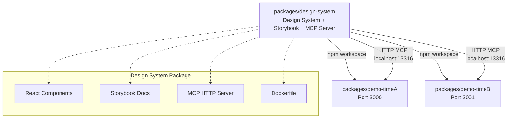

# Frontend MCP Monorepo

Monorepo demonstrating a "near-production" architecture for a centralized design system with **Storybook**, **standalone MCP HTTP server**, and team apps consuming via workspace.

## 🎯 Overview

This monorepo simulates a production environment where:

- **`packages/design-system`** is the central repository:
  - Design System (React components)
  - Storybook (design system documentation)
  - Standalone MCP HTTP server (reads Storybook static build)
  - Dockerfile for MCP server deployment

- **`packages/demo-timeA`** and **`packages/demo-timeB`** are team apps that:
  - Consume the `@org/design-system` package via workspace
  - Don't know the internal code of the design system
  - Use the MCP HTTP endpoint exposed by the design system

### Architecture



## 📋 Prerequisites

- **Node.js** 18+ (recommended: 20+)
- **pnpm** 8+ (or npm/yarn with workspaces)
- **Docker** (for production mode)
- **Cursor** or **VS Code** (with MCP support)

## 🚀 Dev Mode (Local)

### 1. Install Dependencies

```bash
pnpm install
```

### 2. Build Storybook for Design System

First, build the static Storybook build:

```bash
pnpm --filter @org/design-system storybook:build
```

This generates `packages/design-system/storybook-static/` with the necessary files.

### 3. Start Local MCP Server

In a terminal, start the MCP server:

```bash
pnpm --filter @org/design-system mcp:dev
```

The server will be available at:
- **MCP endpoint:** `http://localhost:13316/mcp`
- **Health check:** `http://localhost:13316/healthz`

### 4. Start Storybook (optional, for visualization)

In another terminal:

```bash
pnpm storybook
```

Storybook will be at `http://localhost:6006`.

### 5. Start Team Apps

In separate terminals:

```bash
# Team A
pnpm demo-timeA:dev
# or: pnpm --filter demo-timeA dev
# App at http://localhost:3000

# Team B
pnpm demo-timeB:dev
# or: pnpm --filter demo-timeB dev
# App at http://localhost:3001
```

### 6. Configure Cursor/VS Code for MCP

Each app has its own `.cursor/mcp.json` pointing to the MCP server:

```json
{
  "mcpServers": {
    "org-design-system-mcp": {
      "transport": "http",
      "url": "http://localhost:13316/mcp"
    }
  }
}
```

Reload the editor to detect the configuration.

## 🐳 "Simulated Production" Mode (Docker)

### 1. Build Storybook

```bash
pnpm --filter @org/design-system storybook:build
```

### 2. Build MCP Server

```bash
pnpm --filter @org/design-system mcp:build
```

### 3. Build Docker Image

```bash
pnpm --filter @org/design-system docker:build
```

This creates the image `org/design-system-mcp:local`.

### 4. Run Container

```bash
pnpm --filter @org/design-system docker:run
```

The container exposes the MCP server on port `13316`.

### 5. In Real Production

In real production, you would have:

- **Terraform** provisioning:
  - Kubernetes cluster (or Lambda/API Gateway)
  - Service/Ingress to expose `https://design-system-mcp.your-company.com/mcp`
  
- **CI/CD** doing:
  - Storybook build
  - MCP server build
  - Docker image build
  - Push to registry
  - Deploy to cluster

- **Team apps** using:
  - `@org/design-system` package from npm registry
  - MCP server URL via env var: `MCP_STORYBOOK_URL`

## 🔧 Available Scripts

### Monorepo Root

- `pnpm dev` - Starts all apps in dev mode
- `pnpm build` - Builds all packages
- `pnpm storybook` - Starts Storybook for design system
- `pnpm storybook:build` - Static Storybook build
- `pnpm mcp:dev` - Starts MCP server in dev mode
- `pnpm mcp:build` - Builds MCP server

### Design System (`packages/design-system`)

- `pnpm --filter @org/design-system storybook` - Storybook dev
- `pnpm --filter @org/design-system storybook:build` - Static build
- `pnpm --filter @org/design-system mcp:dev` - MCP server dev
- `pnpm --filter @org/design-system mcp:build` - Build MCP
- `pnpm --filter @org/design-system mcp:start` - Starts MCP (production)
- `pnpm --filter @org/design-system docker:build` - Build Docker
- `pnpm --filter @org/design-system docker:run` - Runs container

### Apps

- `pnpm demo-timeA:dev` - Team A dev
- `pnpm demo-timeB:dev` - Team B dev

## 🔌 MCP Endpoint

The MCP server exposes:

- **POST `/mcp`** - MCP Protocol
  - `tools/list` - Lists available tools
  - `tools/call` - Executes tools:
    - `list-all-components` - Lists all components
    - `find-component-by-name` - Finds component by name
    - `get-component-stories` - Gets stories for a component
    - `get-component-documentation` - Gets component documentation
    - `suggest-composition` - Suggests composition for a use case

- **GET `/healthz`** - Health check
  - Returns status, number of loaded stories, etc.

## 🌍 Environment Variables

### MCP Server

- `PORT` - Server port (default: `13316`)
- `STORYBOOK_STATIC_PATH` - Static build path (default: `storybook-static`)
- `STORYBOOK_URL` - Storybook dev URL (default: `http://localhost:5173`)
- `LOG_LEVEL` - Log level: `debug`, `info`, `warn`, `error` (default: `info`)
- `NODE_ENV` - Environment: `development` or `production`

### Apps (Production)

- `MCP_STORYBOOK_URL` - MCP server URL in production
  - Example: `https://design-system-mcp.internal/mcp`

## 📖 How to Use with AI

See [`AI_RULES.md`](./AI_RULES.md) for:

- AI behavior rules
- Ready-to-use commands
- Recommended workflow

### Quick Example

1. Start the MCP server: `pnpm mcp:dev`
2. Open Cursor/VS Code in one of the apps
3. In the chat, type:
   ```
   Use the org-design-system-mcp MCP to list all available components and suggest an onboarding screen.
   ```
4. The AI will use the MCP to discover components and generate code

## 🐛 Troubleshooting

### MCP Server can't find Storybook

1. Make sure you ran `storybook:build`:
   ```bash
   pnpm --filter @org/design-system storybook:build
   ```
2. Check if `packages/design-system/storybook-static/index.json` exists
3. Check the `STORYBOOK_STATIC_PATH` variable in the server

### Apps can't find `@org/design-system`

1. Make sure you ran `pnpm install` at the root
2. Check if the workspace is configured correctly in the root `package.json`

### Docker build fails

1. Make sure Storybook was built first
2. Check if all necessary files are present
3. Adjust the Dockerfile if necessary for your environment

### MCP icon is yellow in Cursor

1. Check if the MCP server is running: `curl http://localhost:13316/healthz`
2. Verify the `.cursor/mcp.json` configuration
3. Restart Cursor completely (not just reload the window)
4. Check server logs for errors

## 🎓 Next Steps

1. Explore components in Storybook: `http://localhost:6006`
2. Test the MCP server: `http://localhost:13316/healthz`
3. Try the commands from `AI_RULES.md`
4. Create new components in the design system
5. Use components in team apps
6. Simulate production deployment with Docker

## 📝 Important Notes

- **Don't use `@storybook/mcp`**: This project implements its own MCP HTTP server
- **MCP server reads static build**: The server reads `storybook-static/index.json` to discover components
- **Local workspace**: In production, apps would install `@org/design-system` from an npm registry
- **Fixed ports in dev**: 
  - Storybook: `5173` (dev) or `6006` (explicit)
  - MCP: `13316`
  - Team A: `3000`
  - Team B: `3001`

## 📄 License

This is a demonstration project. Feel free to use it as a base.

---

**Developed to demonstrate centralized design system architecture with MCP in a near-production environment.**
